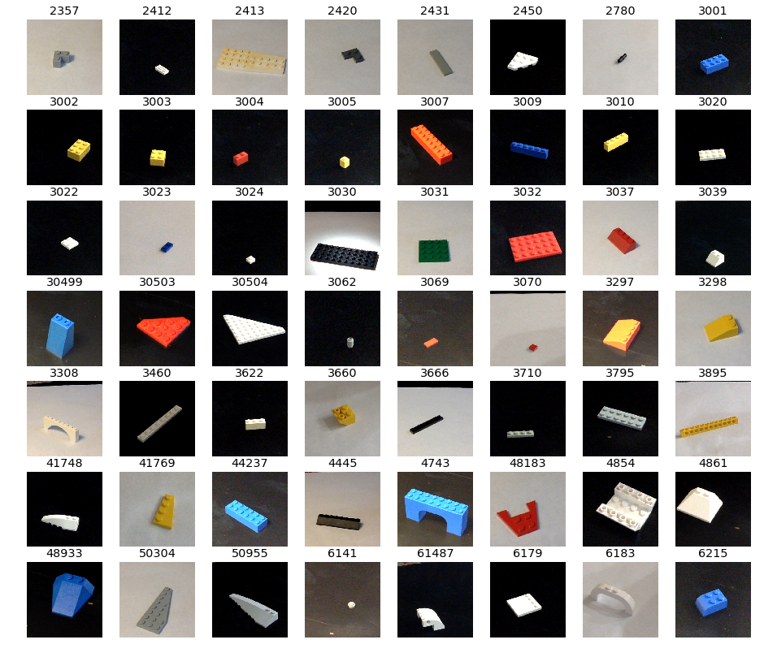

# bricks_from_bins_to_kits

## Data

This folder contains
  * a pickled set of photos which are used for training the CNN.  This file
    consists of 1600+ photos, cropped to 299x299, converted to numpy arrays.  
        X_examples.pkl  
  * a pickled list of labels associating the training photos with brick ID
    numbers.  Each label is the brick ID number.
        y_list.pkl  

This folder also contains the set of 56 photos which are exemplars of the ones
used to train the CNN model.  They are displayed as part of the output of new
predictions to illustrate the model classification.

