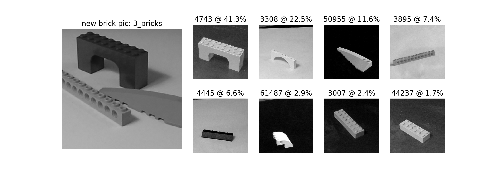

# bricks_from_bins_to_kits

Teaching a convolutional neural network through Keras &amp; TensorFlow to
identify pictures from a mixed bin of Lego bricks and create an inventory
of ID numbers to associate them with their original kits.

## Sources, citations, and acknowledgements
As in any project of all but smallest scope, we see as far as we do by standing
on the backs of giants.  I would like to thank everyone, especially the staff
and instructors at the [Galvanize Data Science Immersion course]
https://www.galvanize.com/seattle/data-science.

As this was part of a learning process, there were many false starts and
backtracking, so it may seem odd to thank sources whose code never appears
in the final product, but these were all part of the process.  THANKS!!

## This folder contains notes on documentation and the development process

### Calculation resources for the 3 incarnations of the application

J - Jupyter notebook version
P - Python ".py" version running and displaying on same computer
A - Application to be executed remotely in server-client relationship

* Python
    * matplotlib -- (all versions)
      (https://matplotlib.org/)
    * PIL (Python image library) -- (all versions)
      (http://www.pythonware.com/products/pil/)
    * OpenCV (J,P)
      (https://opencv-python-tutroals.readthedocs.io/en/latest/)

* TensorFlow neural networks
    * Keras front end - (all versions)
      (https://keras.io/)
    * Inception V3 partially pre-trained model - (all versions)
      (https://www.tensorflow.org/tutorials/image_recognition)

* Javascript and server-client sources for "A" version only
    * Flask
      (https://pythonspot.com/en/flask-web-app-with-python/)
    * Camera stuff
      (https://developer.mozilla.org/en-US/docs/Web/API/WebRTC_API/Taking_still_photos)

* Assorted sources of inspiration, some of which I can't remember whether
  I used much of or not:
    * (https://gist.github.com/wilsaj/862153/119c6fc8ba2b0f3ffcd285a685)
    * (http://html.camera.test.s3-website-us-west-2.amazonaws.com/)

I thank you all.
